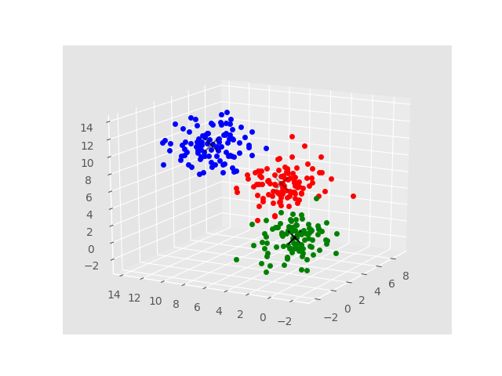

# Mean Shift Clusstering
Implement mean shift cluster from numpy + sklearn + GPU-pytorch

- mean-shift.py: numpy implementation for data with 2 dimension
- mean-shift-np.py: numpy implementation for data with 3 dimension  
- mean-shift-sklearn.py: toy example using sklearn.MeanShift
- mean-shift-pytorch.py: mean shift api for pytorch
- mean-shift-pytorch-gpu.py: mean shift api with pytorch and gpu support

## Statistic: 

|      |mean-shift-np (300p)     | mean-shift-sklean(300p)             |
|:----:|:-----------------------:|-------------------------------------|
| Time | 30.02 s                 | 0.5 s                               |
| Note | No use matrix operator  | Auto bandwidth\\ Parallel with n_jobs |

## Mean-shift-pytorch time statistic

| No data | cpus | time    |
|---------|------|---------|
| 300     | 1    | 0.4s    |
| 300     | 8    | 1.46s   |
| 3000    | 1    | 5.7s    |
| 3000    | 8    | 3.55s   |
| 30000   | 1    | 136.87s |
| 30000   | 8    | 73.10s  |

### Visualization on toy datasets

