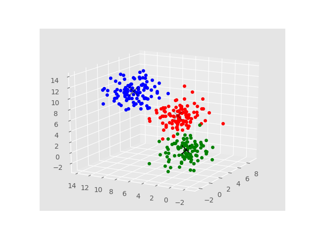
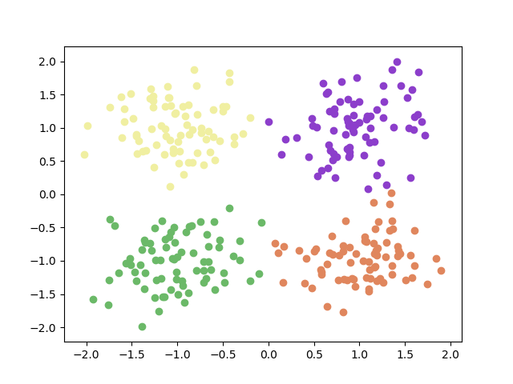

# Mean Shift Clustering

A collection of Mean Shift clustering implementations in Python, ranging from a pure NumPy version to GPU-accelerated PyTorch variants.

## Overview

[Mean Shift](https://en.wikipedia.org/wiki/Mean_shift) is a non-parametric, density-based clustering algorithm. It works by iteratively shifting each data point towards the region of highest density (the mean of nearby points within a given bandwidth), until convergence. Unlike k-means, it does not require the number of clusters to be specified in advance.

## Files

| File | Description |
|------|-------------|
| `mean-shift.py` | Pure NumPy implementation for 2D data |
| `mean-shift-np.py` | Pure NumPy implementation for 3D data |
| `mean-shift-sklearn.py` | Toy example using `sklearn.cluster.MeanShift` |
| `mean-shift-pytorch.py` | Mean Shift API wrapping scikit-learn, accepting PyTorch tensors as input |
| `mean-shift-pytorch-gpu.py` | GPU-accelerated Mean Shift using batch Gaussian kernel operations on CUDA |

## Requirements

- Python 3.x
- NumPy
- scikit-learn
- matplotlib
- PyTorch (required for `mean-shift-pytorch.py` and `mean-shift-pytorch-gpu.py`)

Install dependencies with:

```bash
pip install numpy scikit-learn matplotlib torch
```

## Usage

**Pure NumPy (2D):**
```bash
python mean-shift.py
```

**Pure NumPy (3D):**
```bash
python mean-shift-np.py
```

**scikit-learn wrapper:**
```bash
python mean-shift-sklearn.py
```

**PyTorch (CPU, wraps sklearn):**
```bash
python mean-shift-pytorch.py
```

**PyTorch (GPU-accelerated):**
```bash
python mean-shift-pytorch-gpu.py
```

## Performance

### NumPy vs scikit-learn (300 points, 3D)

|      | mean-shift-np           | mean-shift-sklearn                    |
|:----:|:-----------------------:|:-------------------------------------:|
| Time | 30.02 s                 | 0.5 s                                 |
| Note | No matrix operations    | Auto bandwidth, parallel with n_jobs  |

### PyTorch CPU wrapper (sklearn backend, 3D)

| Points | CPUs | Time     |
|-------:|-----:|----------|
| 300    | 1    | 0.4 s    |
| 300    | 8    | 1.46 s   |
| 3000   | 1    | 5.7 s    |
| 3000   | 8    | 3.55 s   |
| 30000  | 1    | 136.87 s |
| 30000  | 8    | 73.10 s  |

### GPU-accelerated (batch Gaussian kernel, 3D)

| Points | Batch size | Time         | GPU Memory |
|-------:|-----------:|:------------:|:----------:|
| 300    | 1000       | 3.25 s       | 400 MB     |
| 3000   | 1000       | 3.39 s       | 727 MB     |
| 30000  | 1000       | 53.47 s      | 2583 MB    |
| 30000  | 2000       | 34.89 s      | 4641 MB    |
| 30000  | 4000       | 9.42 s       | 8762 MB    |

## Visualization

Results on toy datasets with 3 Gaussian clusters:





